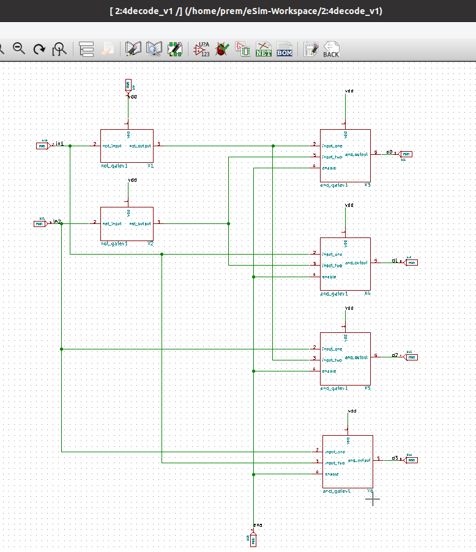
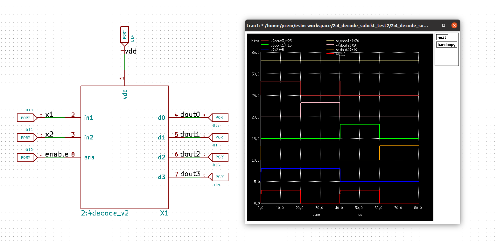
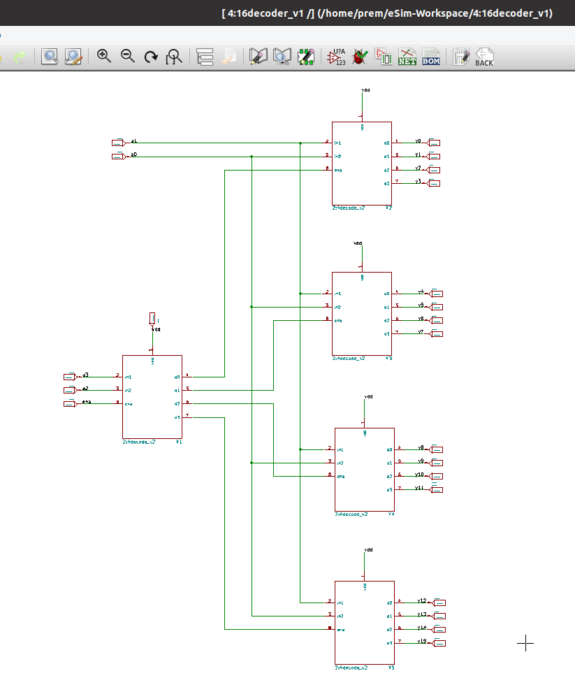
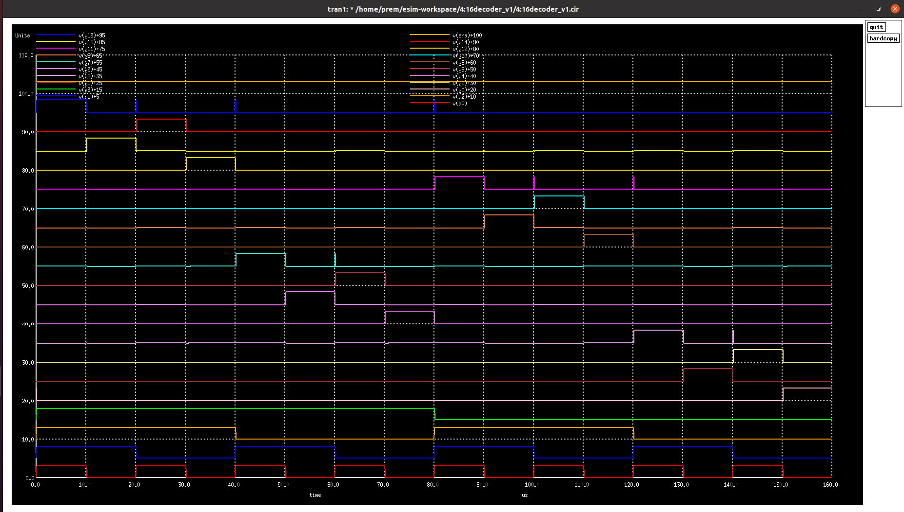
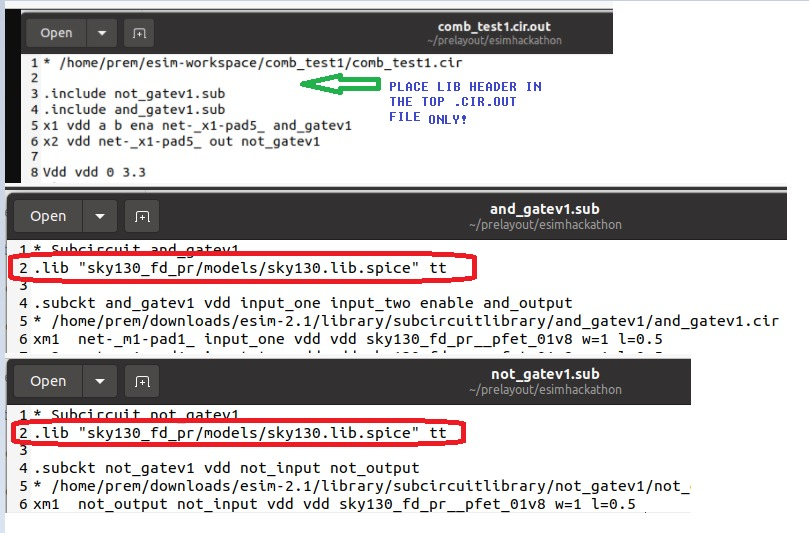
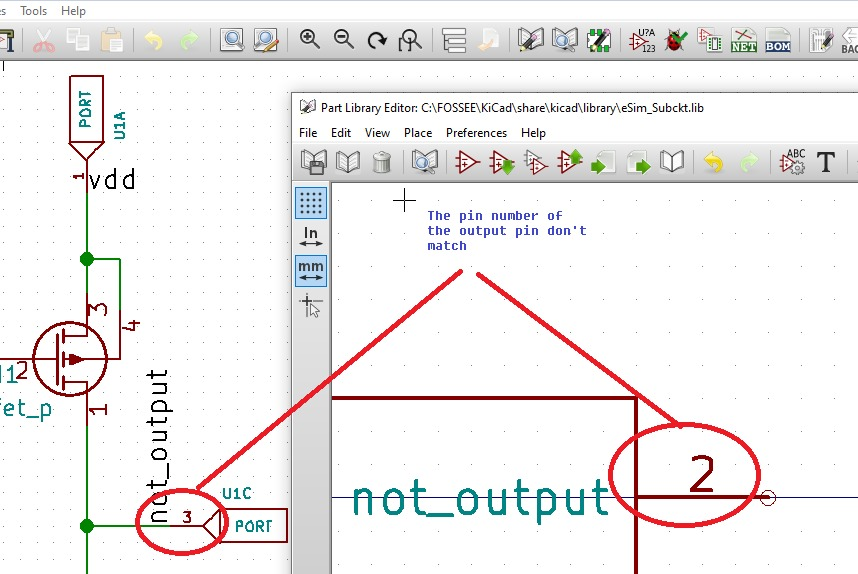
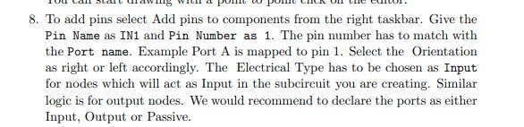
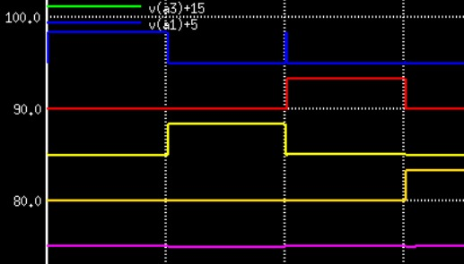

# A 4:16 Decoder in eSim using a bottom up approach 
Documenting the process of simulating a 4:16 decoder using eSim and ngspice for the SFAL VSD Hackathon in Feb 2022. 

## About the work

The project was undertaken to get up to speed with circuit simulation using the FOSSEE eSim tool and get an idea of the workflow involved in a bottom up design 
process. 
Decoders are combinational circuits that take n coded inputs and convert them to 2<sup>n</sup> unique binary ouputs. A 4:16 decoder takes in 4 inputs and makes on of the 16 
output lines high , unique to the input combination. The approach starts at the gate level with NOT and AND gates , which is one way of implementing decoders. A 2T NOT gate and
an 8T AND gate were created as the leaf cells in this bottom up hirearchial approach which make up the subsequent subcircuits for the submodules. A library part was created for 
NOT, AND and 2:4 decdoder submodules in eSim and each of them individually tested using ngspice simulations with sky130pdk mosfet models which makes them compaitable with the 
SkyWater 130nm process. 
Decoders are fundamental blocks in digital electronics that find use in instruction decoding, data multiplexing, demultiplexing , as address decoders for memory circuits
>aka everywhere. 

### Why?
This project was an intent to get accustomed to the eSim software and it's various features as much as possible to get an idea of how design, debugging and troubleshooting works 
in the ESDA space. 

You should be able to use this decoder in your own designs in the eSim tool with the How explained below. Also sharing the many lessons and DOs/Donts that were learned
while doing this project for the SFAL hackathon.
<hr></hr>

<h2> Navigation: </h2>

1. [A 4:16 Decoder](https://github.com/virginrobotics/bottomupdecoder_esim_ngspice#-a-416-decoder-)
2. [NOT Gate submodule](https://github.com/virginrobotics/bottomupdecoder_esim_ngspice#not-gate-submodule)
3. [AND Gate submodule](https://github.com/virginrobotics/bottomupdecoder_esim_ngspice#and-gate-submodule)
4. [2:4 Decoder and submodule](https://github.com/virginrobotics/bottomupdecoder_esim_ngspice#24-decoder-submodule)
5. [4:16 Decoder](https://github.com/virginrobotics/bottomupdecoder_esim_ngspice#realizing-the-416-decoder-using-24-submodules)
6. [Important mistakes](https://github.com/virginrobotics/bottomupdecoder_esim_ngspice#important-mistakes)
7. [Recreating output](https://github.com/virginrobotics/bottomupdecoder_esim_ngspice#recreate-simulation-output)
8. [EDA tools used](https://github.com/virginrobotics/bottomupdecoder_esim_ngspice#eda-tools-used)
9. [Improvements](https://github.com/virginrobotics/bottomupdecoder_esim_ngspice#things-to-improve)
10. [Thanks to](https://github.com/virginrobotics/bottomupdecoder_esim_ngspice#thanks-to)
11. [References](https://github.com/virginrobotics/bottomupdecoder_esim_ngspice/blob/main/README.md#references)

<hr></hr>

<h3> A 4:16 Decoder </h3>

A 4:16 decoder has the following truth table , as referenced from NI Labs [here](https://zone.ni.com/reference/en-XX/help/375482B-01/multisim/4514/)


Here's how an implementation using 2:4 decoders looks like. Image taken from [here](https://qphs.fs.quoracdn.net/main-qimg-121a306eed7896d98b4dc457c76f837c)


<h2>NOT gate submodule</h2>

A NOT gate was implemented using a pmos and nmos mosfet as shown below. 


When the input's a logic high, both nmos and pmos are turned on and all the electrons flow to the drain, leaving output pin low. Conversely a logic low input turns off the nmos but the pmos is high, providing a logic high at the output. 

The same schematic was used as a subcircuit for a the custom made NOT library part, that can now be used in any schematic that needs an inverter. The ngspice simulation along with the NOT gate as a submodule is shown below.


<h2>AND gate submodule</h2>

A three input AND gates is implemented using 4pmos and 4nmos mosfets where the output goes to logic high only when all three inputs go to logic high which include two data inputs and an enable pin. The AND subcircuits is used to create it's own library part for use in higher levels. 


Here's the AND submodule with a NOT submodule to test compaitinility with the ngspice simulation output


<h2>2:4 Decoder submodule</h2>

The NOT and GATE modules now available in the parts bin in eSim are used to implement a 2:4 decoder as shown the schematic. 



Schematic is paired with it's subcircuits from the eSim subcircuit library and converted to it's Ngspice files.

A library part for was created for the same and here's the simulated output.



<h2>Realizing the 4:16 decoder using 2:4 submodules</h2>

5 2:4 Decoder modules are used to implement the final 4:16 decoder



The simulated output shows only one output line is high at any given time and corresponds to the decimal address encoded in the input.



<h2>Important mistakes</h2>

### Placing sky130 library headers in the right place

When creating circuits with subcircuit elements in them, multiple files are created for the project by eSim, but to simulate waveforms in ngspice - only the .cir.out file of the top circuit and the SUB files of the subcircuits are needed. 
In the early attempts , I placed the sky130 lib headers in the SUB files and not in the .cir.out file. It kept crashing ngspice and it took a while before someone pointed it out in the hackathon forum to me. 
Here's what you shouldn't do when you have circuits with multiple subcircuits in the same circuit.



### Choosing right pin numbers and port names in library editor

Another problem that I spent days struggling with but solved after 5 minutes reading the manual was correlating pin numbers on my library part and the subcircuit I was going to pait it with. Here's an example of the error. 



After spending a considerable time scrolling to the New Subcircuit section in the [eSim manual](https://static.fossee.in/esim/manuals/eSim_Manual_2020_August.pdf) :) . The pin numbers for the ports have to match on the subcircuit and the library part being created for it. 



<h2>Recreate simulation output</h2>

- Download the ngspice simulation folder and put the [sky130](https://static.fossee.in/esim/installation-files/sky130_fd_pr.zip) folder in it.
- Move to the directory
- If on windows, open .cir or .cir.out files with ngspice or use the following command to run the .cir.out or .cir file 
  ```ngspice <filename>.cir.out```


<h2>EDA tools used</h2>

### eSim

As taken from their [site](https://esim.fossee.in/home). It also installs ngspice for you of you follow instructions [here](https://esim.fossee.in/downloads)

### SkyWater SKY130 PDK

All mosfets used in the project were sky130 models so the design can be fabricated in their shuttle program for tapeouts. More can be learned [here](https://skywater-pdk.readthedocs.io/en/main/)

<h2>Things to improve</h2>

Right away, on closer inspection, there are many false outputs at the decoder output which can be eliminated using a debouncing mechanism.



<h2>Thanks to</h2>

#### [VSD](https://www.vlsisystemdesign.com/basic_courses/) and [SFAL](https://www.sfalcoe.com/) for organizing the event
#### [Kunal](https://github.com/kunalg123) , [Sumanto](https://github.com/Eyantra698Sumanto) and everybody in the hackathon forum for the help. Had a great time.
#### [Samir Durgoji](https://github.com/SameerSDurgoji) for the eSim walktrough

<h2>References</h2>

- Rajbeer Singh, Manoj Kumar Bandil “An Analysis of CMOS based Low Power 2:4 Decoder at 32nm node using LECTOR Technique” IRJET, vol. 6, issue. 12, pp. 732, Dec. 2019

