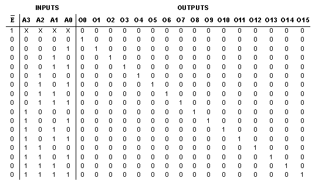
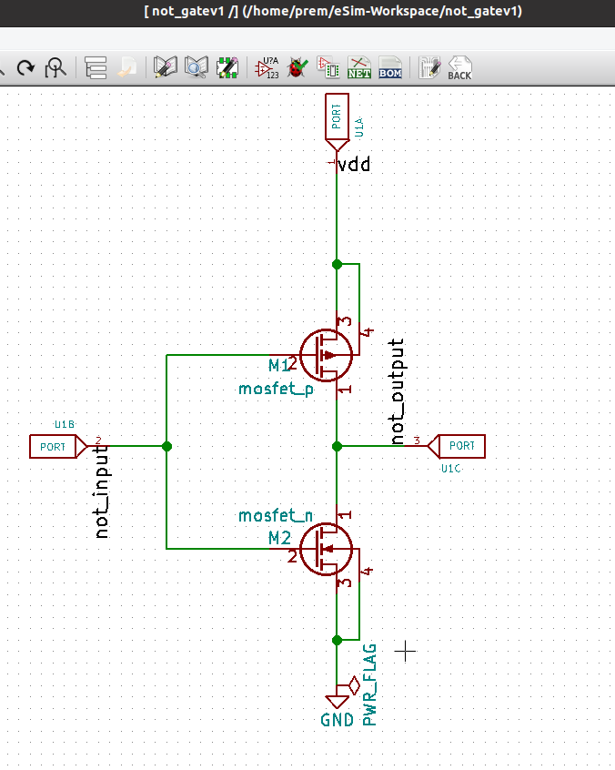
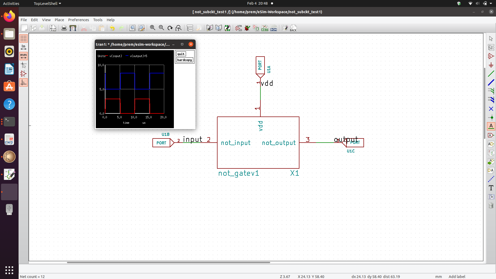
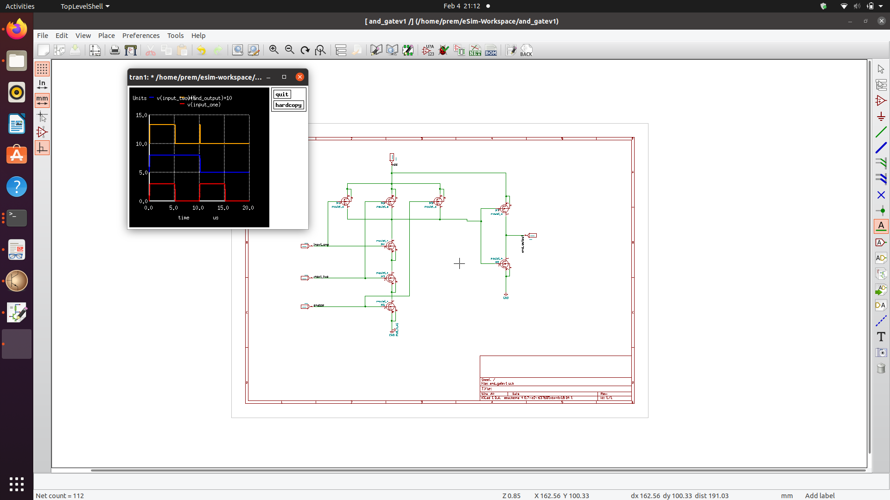
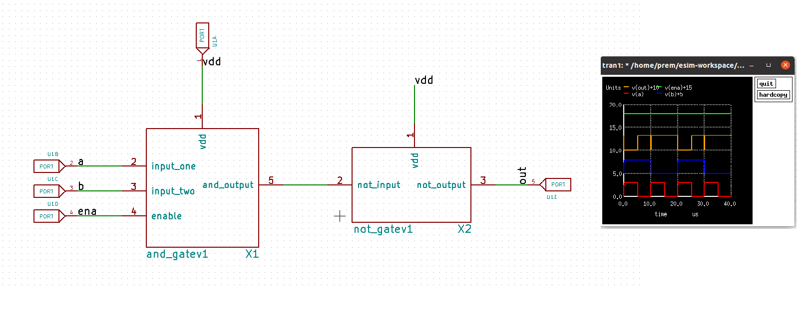

# A 4:16 Decoder in eSim using a bottom up approach 
Documenting the process of simulating a 4:16 decoder using eSim and ngspice for the SFAL VSD Hackathon in Feb 2022. 

## About the work

The project was undertaken to get up to speed with circuit simulation using the FOSSEE eSim tool and get an idea of the workflow involved in a bottom up design 
process. 
Decoders are combinational circuits that take n coded inputs and convert them to 2n unique binary ouputs. A 4:16 decoder takes in 4 inputs and makes on of the 16 
output lines high , unique to the input combination. The approach starts at the gate level with NOT and AND gates , which is one way of implementing decoders. A 2T NOT gate and
an 8T AND gate were created as the leaf cells in this bottom up hirearchial approach which make up the subsequent subcircuits for the submodules. A library part was created for 
NOT, AND and 2:4 decdoder submodules in eSim and each of them individually tested using ngspice simulations with sky130pdk mosfet models which makes them compaitable with the 
SkyWater 130nm process. 
Decoders are fundamental blocks in digital electronics that find use in instruction decoding, data multiplexing, demultiplexing , as address decoders for memory circuits
>aka everywhere. 

### Why?
This project was an intent to get accustomed to the eSim software and it's various features as much as possible to get an idea of how design, debugging and troubleshooting works 
in the ESDA space. 

You should be able to use this decoder in your own designs in the eSim tool with the How explained below. Also sharing the many lessons and DOs/Donts that were learned
while doing this project for the SFAL hackathon.

<h2> Navigation: </h2>

1. [A 4:16 Decoder](-)
2. [eSim FOSSEE](-)
3. [NOT Gate submodule](-)
4. [AND Gate submodule](-)
5. [Testing](-)
6. [2:4 Decoder and submodule](-)
7. [4:16 Decoder](-)
8. [Simulation Result](-)
9. [Important Mistakes](-)
10. [EDA tools used](-)
11. [Thanks to](-)
12. [Improvements](-)

<h3> A 4:16 Decoder </h3>

A 4:16 decoder has the following truth table , as referenced from NI Labs [here](https://zone.ni.com/reference/en-XX/help/375482B-01/multisim/4514/)

Here's how an implementation using 2:4 decoders looks like. Image taken from [here](https://qphs.fs.quoracdn.net/main-qimg-121a306eed7896d98b4dc457c76f837c)

<h2>NOT gate submodule</h2>

A NOT gate was implemented using a pmos and nmos mosfet as shown below. 

When the input's a logic high, both nmos and pmos are turned on and all the electrons flow to the drain, leaving output pin low. Conversely a logic low input turns off the nmos but the pmos is high, providing a logic high at the output. 

The same schematic was used as a subcircuit for a the custom made NOT library part, that can now be used in any schematic that needs an inverter. The ngspice simulation along with the NOT gate as a submodule is shown below.

<h2>AND gate submodule</h2>

A three input AND gates is implemented using 4pmos and 4nmos mosfets where the output goes to logic high only when all three inputs go to logic high which include two data inputs and an enable pin. The AND subcircuits is used to create it's own library part for use in higher levels. 

Here's the AND submodule with a NOT submodule to test compaitinility with the ngspice simulation output

